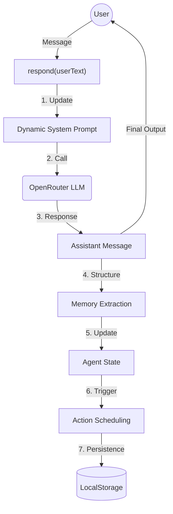

# Agent Architecture: The Learning Path Advisor

This document explains how your colleague built the AI agent in this project. The architecture is modular, efficient, and designed to run primarily on the client-side for maximum snappiness.

## High-Level Workflow

The agent operates in a loop: **Listen → Think → Extract → Act**.



---

## 1. Orchestration: `LearningPathAgent`
Located in [chat-agent.ts](./lib/chat-agent.ts)

This is the "brain" that connects everything. Instead of a static prompt, it uses a **Dynamic System Prompt**. 

- **How it works**: Every time you send a message, the agent checks its current "Memory" and rebuilds the instructions for the LLM. 
- **The Benefit**: It explicitly tells the LLM what it *still needs to find out* (e.g., "Still need: Clear learning objective").

```typescript
// Example of how the agent "talks to itself" inside the prompt
private buildContextParts(): string[] {
    const memory = this.state.getMemory();
    const parts: string[] = [];
    parts.push(memory.objective ? `Objective: ${memory.objective}` : "Still need: Clear learning objective");
    // ...
}
```

---

## 2. Shared Memory: `AgentState`
Located in [agent-state.ts](./lib/agent-state.ts)

This component handles the "Identity" of the user. It doesn't just store chat history; it stores a **structured user profile** called `AgentMemory`.

- **Persistence**: All data is mirrored to `localStorage`. If you refresh the page, the agent remembers who you are and where you left off.
- **State Schema**: Includes fields like `objective`, `relevant_skills`, `required_skills`, and `constraints`.

---

## 3. Intelligent Extraction
Located in `LearningPathAgent.extractAndUpdateMemory`

This is the most powerful part. After the assistant responds to you, it makes a *second, invisible call* to the LLM.

- **The Goal**: To turn conversational text into JSON data.
- **The Logic**: If you say "I'm a beginner but I want to learn ML", the extractor identifies "beginner" as `skill_level` and "ML" as a `required_skill`.
- **JSON Schema**: It uses a strict schema to ensure the data is always clean and predictable.

---

## 4. Proactive Behavior: `AgentActions`
Located in [agent-actions.ts](./lib/agent-actions.ts)

This component decides when to "do something" beyond just talking.

- **Trigger base**: It waits for specific flags in memory (like `learning_path_created`).
- **Scheduling**: Once a learning path is detected in the chat history, it automatically schedules actions to save the data or send it to a backend API.

```typescript
// Scheduling logic
if (memory.learning_path_created && !memory.scheduled_actions.includes(ActionType.SAVE_LEARNING_PATH)) {
    this.pendingActions.push({
        type: ActionType.SAVE_LEARNING_PATH,
        data: { /* ... */ }
    });
}
```

---

## Summary for Your Future Agent
If you want to build your own, follow these principles from your colleague's code:
1.  **Keep State Separated**: Logic lives in the agent, but data lives in the state.
2.  **Extract Patterns**: Don't just chat; extract structured data so your app can react to it.
3.  **Dynamic Prompts**: Help the LLM by giving it "Context Parts" so it knows what its current goals are.
