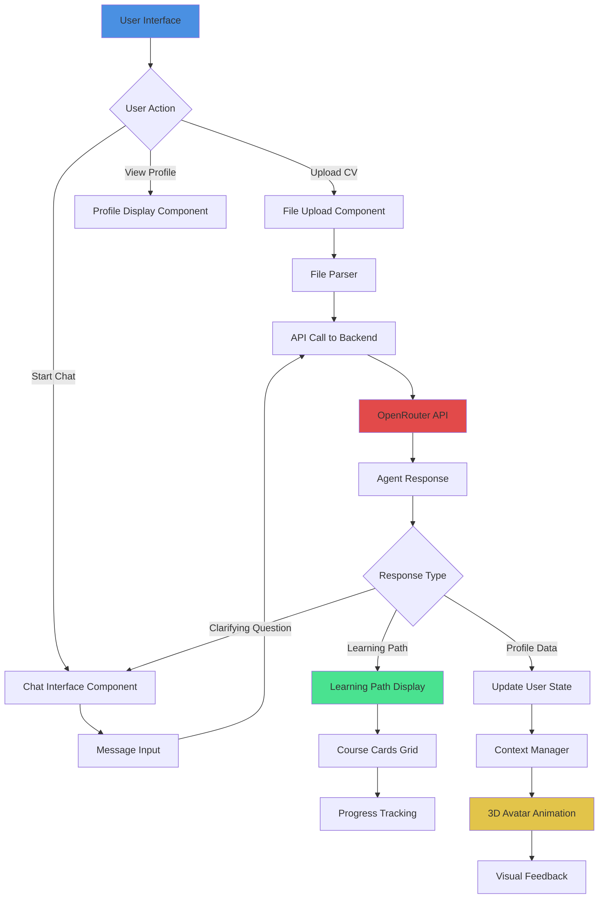
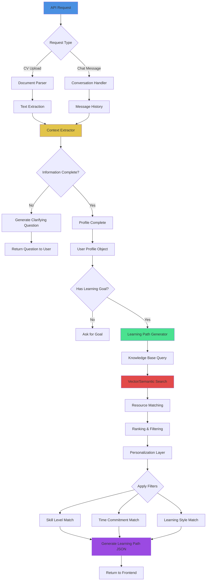
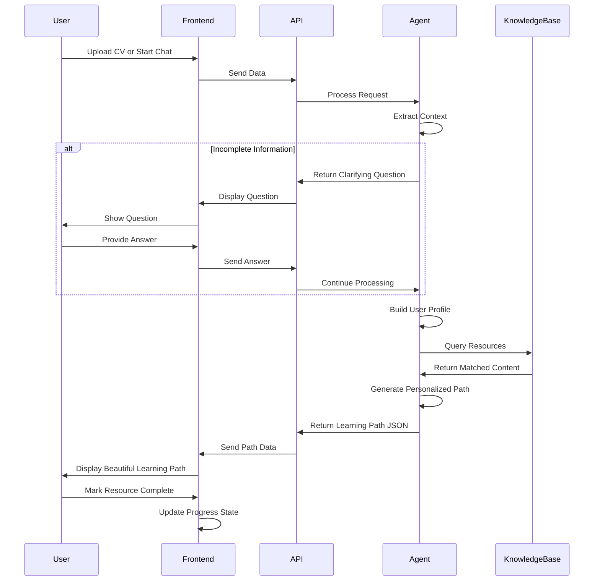

# Hackathon Architecture - Data Flow & Structure

## Frontend Architecture



## Backend (Agent Logic) Architecture



## System Data Flow (End-to-End)



## Component Responsibilities

### Frontend Team Responsibilities

| Component | Purpose | Key Features |
|-----------|---------|--------------|
| **File Upload** | Handle CV/PDF uploads | Drag-drop, file validation, preview |
| **Chat Interface** | Natural conversation | Message history, typing indicators, smooth UX |
| **Profile Display** | Show extracted user info | Skills, experience, goals visualization |
| **Learning Path Display** | Show personalized courses | Card grid, filters, progress bars |
| **3D Avatar** | Visual engagement | Animations, reactions, personality |
| **State Management** | Handle app state | User profile, conversation, progress |
| **API Integration** | Connect to backend | OpenRouter calls, error handling |

### Backend Team Responsibilities

| Component | Purpose | Key Features |
|-----------|---------|--------------|
| **Document Parser** | Extract text from CV | PDF parsing, text cleaning, structure detection |
| **Context Extractor** | Understand user info | Named entity recognition, skill extraction, intent detection |
| **Conversation Handler** | Manage chat flow | Context tracking, question generation, state machine |
| **Profile Builder** | Create user profile | Aggregate info, identify gaps, structure data |
| **Learning Path Generator** | Create personalized paths | Resource matching, sequencing, difficulty progression |
| **Knowledge Base** | Store learning resources | Resource metadata, search indexing, categorization |
| **Personalization Engine** | Apply user preferences | Filtering, ranking, adaptation |

## Data Structures

### User Profile Object
```json
{
  "user_id": "generated-uuid",
  "name": "string",
  "current_role": "string",
  "experience_level": "junior|mid|senior",
  "skills": ["skill1", "skill2", "skill3"],
  "learning_goal": "string",
  "target_role": "string",
  "time_commitment": "hours per week",
  "learning_style": "video|reading|hands-on",
  "context_complete": true
}
```

### Learning Path Object
```json
{
  "path_id": "generated-uuid",
  "title": "string",
  "description": "string",
  "total_duration": "X weeks",
  "difficulty": "beginner|intermediate|advanced",
  "resources": [
    {
      "id": "resource-1",
      "title": "Resource Title",
      "type": "course|article|video|documentation",
      "url": "https://...",
      "provider": "Coursera|LinkedIn|etc",
      "duration": "X hours",
      "skill_focus": ["skill1", "skill2"],
      "difficulty": "string",
      "order": 1,
      "completed": false
    }
  ]
}
```

### Knowledge Base Resource
```json
{
  "resource_id": "unique-id",
  "title": "string",
  "description": "string",
  "url": "string",
  "type": "course|article|video|book|documentation",
  "provider": "string",
  "skills": ["skill1", "skill2"],
  "difficulty": "beginner|intermediate|advanced",
  "duration": "X hours",
  "rating": 4.5,
  "free": true,
  "keywords": ["keyword1", "keyword2"],
  "prerequisites": ["skill1"]
}
```

## Technology Stack Recommendation

### Frontend Stack
- **Framework**: Next.js 14 (App Router)
- **3D**: React Three Fiber + Drei
- **Styling**: Tailwind CSS
- **State**: React Context API
- **API Client**: Fetch API / Axios
- **File Upload**: react-dropzone
- **Animations**: Framer Motion

### Backend Stack
- **API**: OpenRouter (Claude Sonnet 4)
- **Parser**: pdf-parse or PyPDF2
- **Search**: Simple keyword matching OR sentence-transformers for MVP
- **Database**: JSON files for MVP (can upgrade to Supabase later)
- **Hosting**: Vercel (Frontend) + Python API on same or separate

## MVP Feature Priority

### Must Have (Priority 1)
1. ✅ Upload CV or answer 3 questions
2. ✅ Extract user context (role, skills, goal)
3. ✅ Generate 3-5 resource learning path
4. ✅ Display path beautifully
5. ✅ Mark resources as complete

### Should Have (Priority 2)
6. 🔄 3D avatar with basic animations
7. 🔄 Save progress (localStorage)
8. 🔄 Export learning path as PDF
9. 🔄 Filter resources by type/duration

### Nice to Have (Priority 3)
10. ⭐ Share learning path link
11. ⭐ Multiple learning paths
12. ⭐ Integration with LinkedIn
13. ⭐ Resource recommendations

## Integration Points

### Where Frontend Meets Backend

```javascript
// Frontend API Call
async function generateLearningPath(userProfile) {
  const response = await fetch('/api/generate-path', {
    method: 'POST',
    headers: { 'Content-Type': 'application/json' },
    body: JSON.stringify(userProfile)
  });
  return response.json();
}

// Backend API Endpoint
app.post('/api/generate-path', async (req, res) => {
  const userProfile = req.body;
  const learningPath = await agentLogic.generatePath(userProfile);
  res.json(learningPath);
});
```

## Development Workflow

### Day 1-2: Foundation
- **Frontend**: Setup Next.js, create basic components
- **Backend**: Setup API, create data structures
- **Both**: Define API contracts and test with mock data

### Day 3-4: Integration
- **Frontend**: Connect to real API, polish UI
- **Backend**: Implement agent logic, test with real data
- **Both**: End-to-end testing

### Day 5-6: Polish & Demo
- **Frontend**: Animations, responsive design, error handling
- **Backend**: Performance optimization, edge cases
- **Both**: Demo preparation, pitch deck

## Questions for Team Alignment

1. **Who owns the OpenRouter API integration?** (Frontend or Backend?)
2. **Where do we store user progress?** (LocalStorage for MVP or simple DB?)
3. **How do we seed the knowledge base?** (Manual curation or scraping?)
4. **What's our demo user story?** (Project Manager → Product Manager transition?)
5. **Who creates the pitch deck?** (Assign owner)

## Success Metrics for Judges

1. **Speed**: Profile to learning path in <30 seconds
2. **Accuracy**: Resources match user's level and goals
3. **UX**: Smooth, delightful, no confusion
4. **Innovation**: No tedious forms, instant personalization
5. **Feasibility**: Actually works in demo

---

**Remember**: Perfect is the enemy of done. Focus on making ONE user journey work flawlessly rather than building many half-working features.
